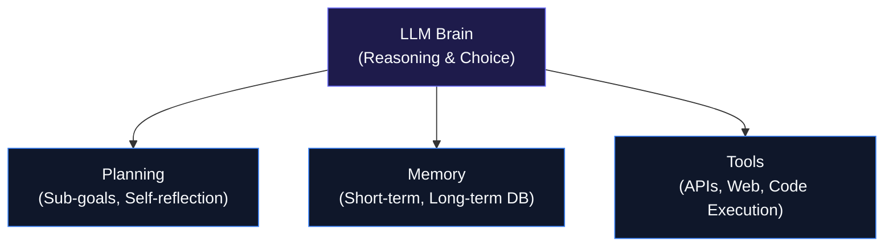

# AI Agents Explained: Planning, Memory, Tools & Multi-Agent Systems

A standard chatbot answers one question at a time. Ask it to "book me a flight to Tokyo, reserve a quiet hotel near a train station, and draft an itinerary based on my preferences," and it runs into a wall — that's a multi-step task, not a single exchange, and a plain chatbot has no way to execute it. An AI agent is built for exactly this kind of request: it's an LLM paired with a way to act, a way to remember, and a way to plan, so that instead of just responding to a prompt, it works toward a goal through reasoning and real tool use.

## 1. The core architecture of an agent

The LLM functions as the agent's reasoning engine, but turning that into something that can actually get work done requires three additional capabilities layered on top.



**Planning.** Given a large objective, the agent uses chain-of-thought reasoning to break it into smaller sub-tasks — booking a flight, for instance, decomposes into searching airlines, comparing prices, checking the budget, and then calling a booking API. When something goes wrong along the way, such as a failed API call or a bad result, the agent can pause, assess what happened, and try a different approach instead of simply stopping.

**Memory.** Short-term memory is the ongoing conversation itself — what was said a couple of minutes ago, still available. Long-term memory works differently: past interactions, stated preferences, and document history get stored in a vector database, which is what allows the agent to recognize a returning user across separate sessions.

**Tools.** An agent without tools can only talk; with tools, it can act. These are external APIs or scripts it can call on — a web search API, a calculator or Python interpreter, a database lookup, or triggers into third-party software like Zapier, Slack, or email.

## 2. The ReAct loop: reason, then act

Agent execution generally runs on a loop called ReAct, short for reasoning and acting. The agent thinks through what to do next, picks a tool and sends it an input, reads back whatever the tool returns, and repeats that cycle until the goal is met.

## 3. Multi-agent systems

A single agent handling a genuinely complex workflow tends to get overloaded, which is why more involved tasks are often split across a team of specialized agents instead — not unlike how a magazine gets produced by people with different jobs.

| Agent Role | Specialty | Responsibilities |
| --- | --- | --- |
| Researcher | Fact-finding | Searches the web, pulls data, compiles raw facts |
| Writer | Content creation | Turns raw research into a cohesive draft |
| Editor | Quality control | Checks the draft for errors, sends revisions back to the writer |
| Manager | Coordination | Delegates tasks and tracks progress |

Splitting the work this way means each agent runs on a prompt tailored specifically to its job, which tends to produce better output with fewer errors than asking one agent to do everything at once.

## 4. A ReAct loop in Python

This prototype shows an agent reasoning its way to a tool call — in this case, a calculator — to solve a problem it wouldn't handle reliably on its own:

```python
import json

# 1. Define a mock tool (calculator)
def calculate(expression: str) -> str:
    try:
        return str(eval(expression))
    except Exception as e:
        return f"Error: {e}"

# 2. Simulated agent decision-making loop
def simple_agent(user_goal: str):
    print(f"Goal: {user_goal}\n")

    # Step 1: Thought
    thought = "I need to calculate the total price of 14 items at $29.99 each with 8% tax."
    print(f"[Thought] {thought}")

    # Step 2: Action selection
    action_tool = "calculate"
    action_input = "(14 * 29.99) * 1.08"
    print(f"[Action] Calling tool '{action_tool}' with input: {action_input}")

    # Step 3: Observation (executing tool)
    if action_tool == "calculate":
        observation = calculate(action_input)

    print(f"[Observation] Tool returned: {observation}")

    # Final answer
    final_answer = f"The total price comes out to ${float(observation):.2f}."
    print(f"\n[Final Output] {final_answer}")

# Run the agent loop
simple_agent("Calculate 14 items at $29.99 each plus 8% tax")
```

```
Goal: Calculate 14 items at $29.99 each plus 8% tax

[Thought] I need to calculate the total price of 14 items at $29.99 each with 8% tax.
[Action] Calling tool 'calculate' with input: (14 * 29.99) * 1.08
[Observation] Tool returned: 453.4488

[Final Output] The total price comes out to $453.45.
```

## The core idea

What separates an agent from a chatbot is the shift from answering to doing. Once planning, memory, and tools are layered onto an LLM's reasoning, it becomes possible to hand off a workflow rather than a single question — and to have several such agents, each with a narrower job, working through parts of it together.
