The way applications are built on top of large language models has changed substantially over the past several years. In the earliest phase of this work, the central question was narrow: how does one phrase a request so that the model responds usefully? As applications matured, new problems surfaced in sequence. What happens when the model lacks the information it needs to answer? What happens when the task requires an action in the world rather than a block of text? And what happens when a task cannot be resolved in a single pass at all, but instead requires retries, decisions, specialized subsystems, human sign-off, persistent memory, and coordination across external tools?

Each of these problems forced the underlying engineering abstraction to expand. One way to organize that expansion is as a rough five-stage progression:

* 2022 — Prompt Engineering
* 2023 — Context Engineering
* 2024 — Agent Engineering
* 2025 — Loop Engineering
* 2026 — Graph Engineering

These are not formally codified disciplines with agreed-upon boundaries; the years are approximate and the categories overlap considerably. They are better read as five layers that accumulated on top of one another as the scope of what engineers control kept widening: from instruction, to information, to action, to iteration, to orchestration. Put differently, the question changed from what the model should say, to what it should know, to what it can do, to how it should iterate, to how the whole system should behave.

---

## Before the LLM application era

It helps to start with what came before. Traditional machine learning pipelines followed a fairly fixed shape: data went into training, training produced a model, the model produced predictions, and predictions fed an application. When performance was poor, the fix almost always involved touching the model itself — the training data, the features, the architecture, the hyperparameters, or the fine-tuning process.

### Architecture: Traditional ML application

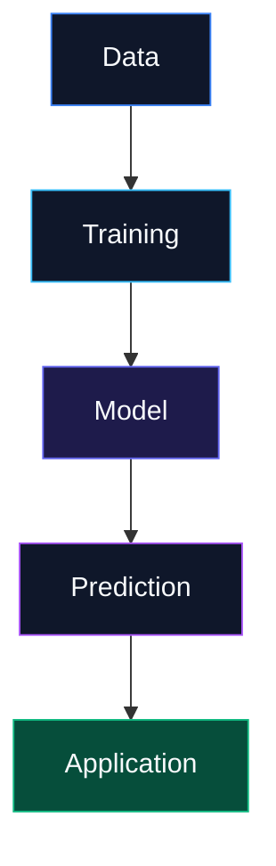

Large language models broke that pattern. Rather than retraining a model for each new task, developers could increasingly describe the task in plain language and let a general-purpose model handle it. Brown et al.'s 2020 GPT-3 paper was an important marker of this shift, showing that scaling a language model could produce strong few-shot performance when tasks were specified through instructions and demonstrations rather than gradient updates. The developer's job changed accordingly. The model already knew how to do a great many things; the open question became how to communicate a given task to it effectively. That question gave rise to the first layer.

---

## 2022: Prompt engineering

Prompt engineering rests on a simple premise: if a model's output depends heavily on how it is asked, then the instructions themselves become something worth engineering. Instead of building a separate model per task, developers manipulated the prompt — the instructions, the examples, the constraints — while holding the model fixed.

### Architecture: Prompt Engineering

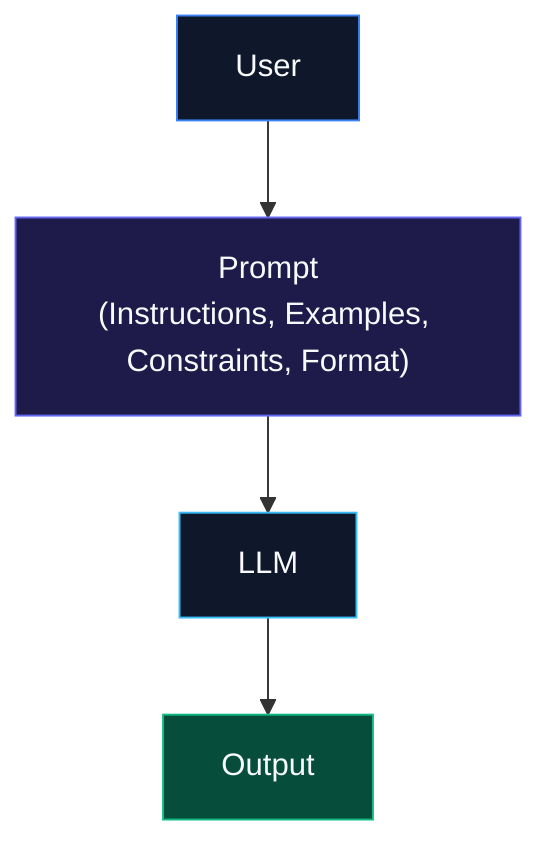

A basic application from this period looked like a short pipeline: a user's request became a prompt, the prompt went to the model, and the model produced an output. The engineering surface was narrow, essentially prompt to model to output, and the techniques that developed around it were correspondingly focused: zero-shot and few-shot prompting, role instructions, demonstrations, task decomposition, explicit reasoning steps, and output formatting constraints. Wei et al.'s work on chain-of-thought prompting showed that including intermediate reasoning steps in the prompt could meaningfully improve performance on reasoning-heavy tasks, and instruction-tuning research such as InstructGPT demonstrated the value of aligning models more directly with what users actually intend when they issue an instruction.

Prompt engineering addressed a real problem: the model held enormous general knowledge and capability, and the challenge was activating the right slice of it for a given task. But it ran into a hard limit almost immediately. A model does not know what it was never given. An internal company assistant might reason well about programming or general history, but it has no access to a company's internal policies, current inventory, private databases, recent internal documentation, or a specific user's records — and no amount of prompt rewriting can put that information inside the model. That gap raised the next question: could the information entering the model's context be engineered directly?

---

## 2023: Context engineering and RAG

The center of attention shifted from how to instruct the model to what information the model should actually see. It's worth noting that retrieval-augmented generation did not originate in 2023 — Lewis et al. introduced the core RAG formulation in 2020, pairing a parametric language model with a non-parametric retrieval mechanism. What changed in 2023 was that the explosion of practical LLM applications turned retrieval-based architectures into one of the default patterns for building anything that needed up-to-date or proprietary information.

### Architecture: Context Engineering / RAG

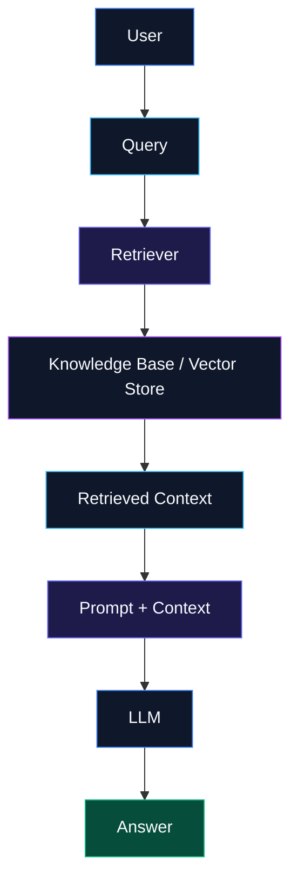

The architecture grew a new stage. Rather than a user's query going straight to the model, it first passed through a retriever that pulled relevant material from a knowledge base or vector store; that retrieved material was folded into the prompt before the model ever saw the question. The pipeline went from user-to-prompt-to-model to something closer to user-to-retrieval-to-context-construction-to-model.

This was necessary because model parameters are an imperfect store of knowledge. Lewis et al.'s original paper pointed specifically to the difficulty of precise knowledge access, the cost of updating what a purely parametric model knows, and the lack of provenance for its claims — all problems that retrieval at inference time could partially address. The shift also opened an entire new set of engineering concerns that had nothing to do with prompting: how documents get ingested and turned into usable knowledge, how they're chunked, how they're embedded, which chunks a retriever should surface, how those results get reranked, how the useful pieces are packed into a limited context window, and what should persist as memory across turns. "Context engineering" is a reasonable umbrella term for all of this — where prompt engineering controls the instructions themselves, context engineering controls the information that surrounds them.

Once a model could pull in outside information, an adjacent question became hard to avoid: if it can retrieve from external systems, why shouldn't it also be able to act on them?

---

## 2024: Agent engineering

The next transition moved models from primarily generating text to deciding and acting. A plain LLM can tell you the approximate distance between two cities, but a travel assistant that actually needs to book something has to search flights, compare prices, check hotel availability, look at weather, work out a budget, and assemble an itinerary — a set of tasks that amounts to interacting with an environment rather than producing a paragraph.

Two pieces of research are worth naming here. ReAct combined reasoning and acting into a single interleaved process, letting a model reason about what to do, take an action, observe the result, and continue rather than treating reasoning and acting as separate stages. Toolformer approached a related problem from a different angle: teaching a model to decide on its own which external APIs to call, when to call them, what arguments to pass, and how to fold the results back into its response.

### Architecture: Agent Engineering

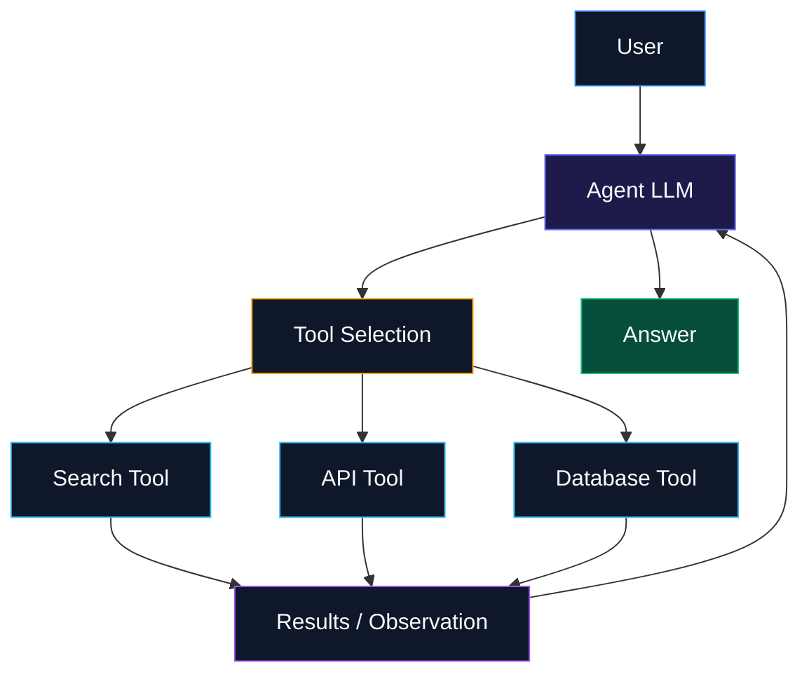

Architecturally, this added a tool-selection stage between the model and its output: the model chooses among available tools such as search, an API, or a database, receives results back, and continues reasoning before finally responding. The important shift is that a tool call is rarely the end of a task. A search might turn up something that needs a second search. An API might return an error. Generated code might fail its tests. A claim might need independent verification. In each case, the system has to keep working rather than stopping after one action, and that need for continuation is what the next layer addresses.

---

## 2025: Loop engineering

"Loop engineering" is used here deliberately as a descriptive label rather than a claim that the industry has settled on the term. The underlying pattern, though, is real and widely observed: agent systems increasingly run on an iterative cycle of reasoning, acting, observing the result, evaluating whether that result is good enough, and repeating if it isn't. That is a meaningful departure from a single LLM call, because the system is now allowed to respond to its own intermediate output rather than committing to a first attempt.

### Architecture: Loop Engineering

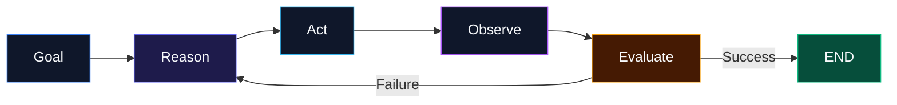

Loops became necessary because difficult tasks are rarely solved correctly on the first try. A coding agent, for instance, typically has to understand the task, inspect the relevant repository, write code, run the tests, discover that some of them fail, inspect the failure, revise the code, and run the tests again before finally succeeding. A research agent follows a similar shape: search, read the sources, extract claims, verify them, notice what's still missing, search again, and only then synthesize an answer. In both cases the system behaves as a feedback loop rather than a single generative step.

This raised a fresh set of engineering questions that prompting and retrieval never had to answer: how many iterations should be permitted, what should count as success or failure, whether the system should retry with the same approach or switch strategies, whether a separate model should evaluate the result, how to prevent runaway loops, and how to keep token costs and latency under control given that the model is now part of an ongoing control process rather than a one-shot generator.

Loops are straightforward when the underlying workflow is genuinely linear. Real applications, though, don't always stay that simple. A task might need to be classified first, then routed to a search step, a database lookup, or a human reviewer depending on what it turns out to require, with the results funneling back into an evaluation step that decides whether to retry or move on. At that point a developer isn't really engineering a loop anymore — they're engineering a workflow with branches, which is a natural lead-in to graphs.

---

## 2026: Graph engineering

As with "loop engineering," the label "graph engineering" here is a proposed way of describing an architectural pattern rather than a claim about industry-wide terminology. The underlying architecture, by contrast, is well established. LangChain publicly introduced LangGraph in January 2024 specifically to make cyclical graphs easier to build for agent runtimes, organizing execution around explicit state, nodes, and transitions.

### Architecture: Graph Engineering

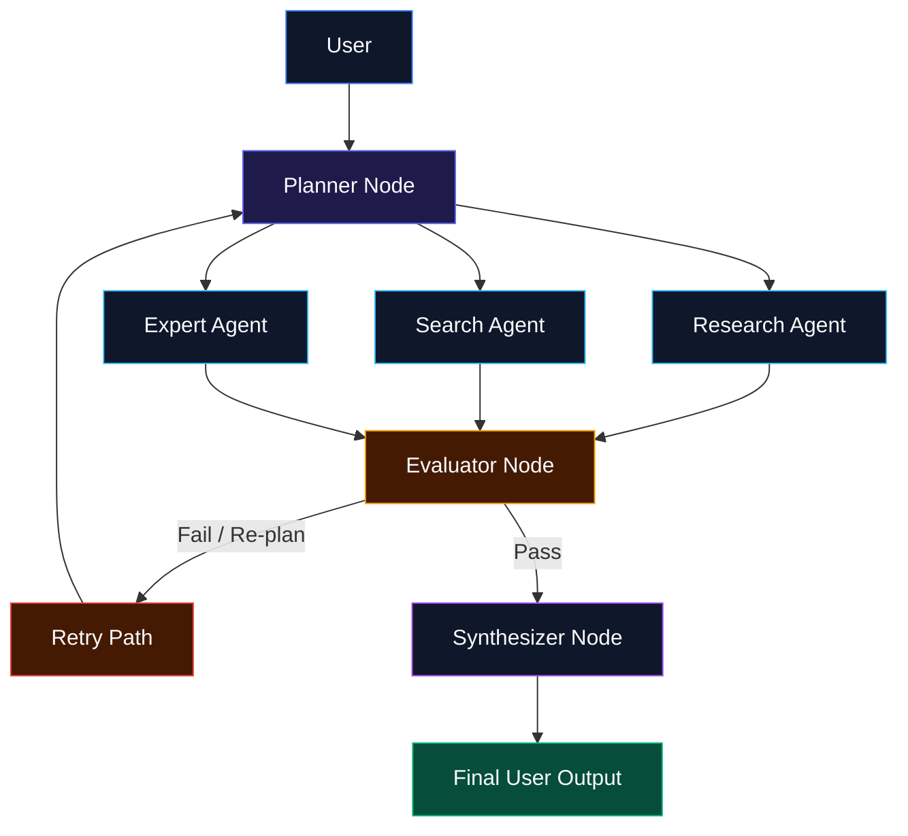

The reasoning behind this shift is straightforward: a sufficiently complex AI application is often represented more faithfully as a graph than as a single loop. A multi-agent research system illustrates the point. A planner receives the user's request and distributes work across, say, a research agent, a search agent, and a domain-expert agent; their outputs converge on an evaluator, which either sends the work back to the planner for another pass or forwards it to a synthesizer that produces the final answer for the user. Some of the nodes in a system like this are purely deterministic, some contain individual LLM calls, some contain entire agents, some call external tools, some loop internally, and some require a human to sign off before continuing. Taken together, this is a stateful workflow rather than a single reasoning chain.

---

## What separates a graph from a loop

A loop essentially says: keep doing this until you're done. A graph says something more specific — here are the possible states the system can be in, the actions available in each one, and the rules governing how it moves between them. That distinction lets a graph represent things a loop cannot express cleanly.

### State, nodes, and edges

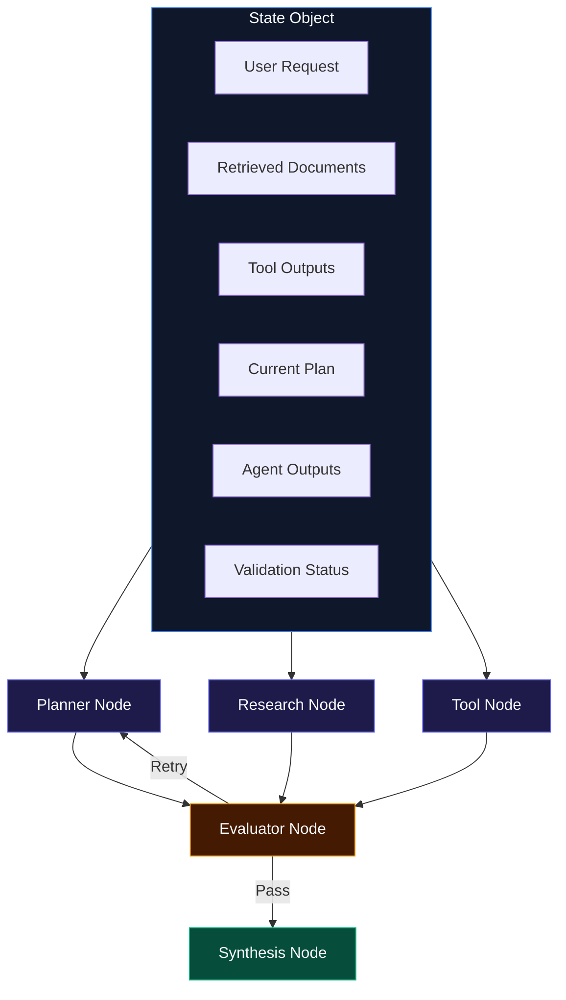

State captures what the system currently knows — the user's original request, any retrieved documents, tool outputs, the current plan, individual agent outputs, and a validation status, all held together as the system moves forward. Nodes represent units of work: a planner, a retriever, a researcher, a tool call, an evaluator, a human reviewer, a synthesizer. Edges define what happens after a given node finishes — a planner's output going to a researcher, a researcher's output going to an evaluator, an evaluator either sending things back to the researcher or forward to the synthesizer. Conditional routing lets the evaluator's judgment (pass or fail) determine which of those two paths gets taken. And human-in-the-loop nodes let an agent pause for explicit approval before proceeding, with the human's decision determining whether the system continues or reworks its output.

This kind of explicit control is a large part of why graph-based orchestration has become attractive for production systems. LangGraph's own architecture treats nodes as units of work operating over shared state and edges as the rules for how execution proceeds between them, and its creators have been fairly direct about the motivation: developers often want more control than a simple agent loop offers — forcing a particular tool, constraining how tools are called, adjusting prompts based on the current state, or inserting a human approval step at a specific point.

---

## Multi-agent graphs

Graph-based thinking becomes especially useful once multiple agents are involved, because it gives each one a clearly bounded role. In a typical multi-agent setup, a supervisor distributes work among specialized agents — research, coding, analysis — each of which can carry its own prompt, its own tools, its own underlying model, and its own memory; their outputs converge on an evaluator before returning to the supervisor. LangGraph's early multi-agent documentation described this in graph terms explicitly: agents become nodes, and the communication and control flow between them become edges.

### Architecture: Multi-Agent Graph

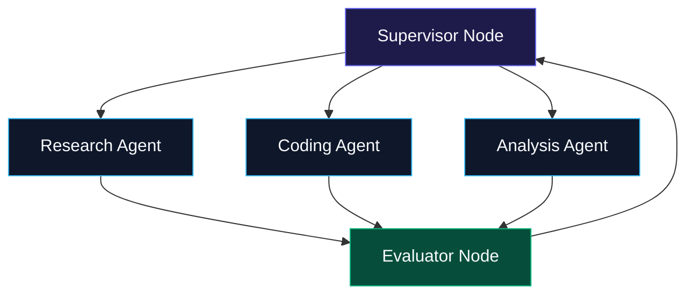

The architectural principle that falls out of this is fairly intuitive: a single agent shouldn't be made responsible for everything if the underlying problem decomposes naturally into specialized roles. A research agent generally doesn't need every tool a coding agent needs, a coding agent doesn't need a research agent's tools, and a financial-analysis agent may need an entirely different toolkit from a customer-support agent. Representing the system as a graph makes those boundaries explicit rather than leaving them implicit inside one overloaded agent.

---

## The five layers accumulate rather than replace each other

Perhaps the most important point in this framework is that none of the five layers displaced the one before it. Prompt engineering was not made obsolete by retrieval. Retrieval was not made obsolete by agents. Agents were not made obsolete by graphs. Instead, each layer folded into the next: a graph node can contain a prompt, an agent can contain several prompts, a retrieval system can use a prompt to generate its own queries, and an evaluator or planner is very often just another prompt operating on the current state. RAG did not disappear once agents arrived — many agents depend on retrieval to function at all — and loops did not disappear once graphs arrived, since a graph frequently contains several loops nested inside it. The progression, in other words, is one of composition rather than replacement.

### The accumulated architecture

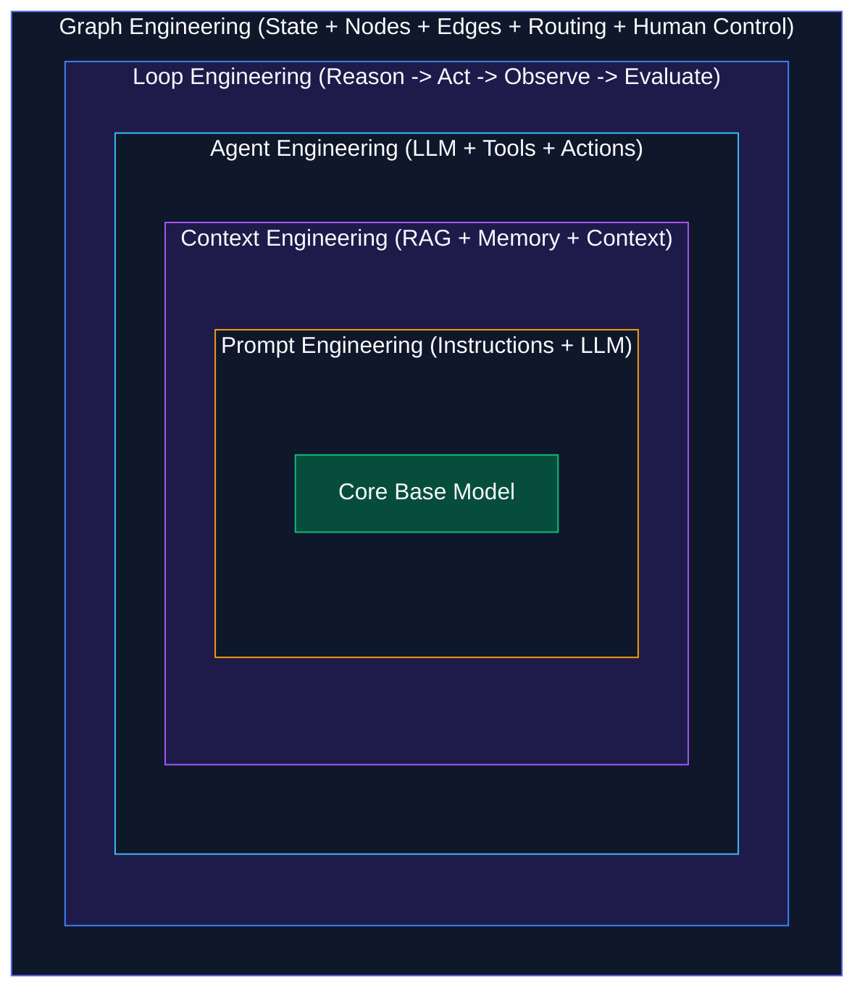

---

## Where MCP fits

The Model Context Protocol is a useful example of a more recent, narrower development within this picture: a standardized way for AI systems to connect to external tools and data sources. It sits primarily at the context and tool-integration layer rather than functioning as a substitute for agents or graphs — it answers a specific question about how applications connect to the outside world in a consistent way, not the broader question of how a whole system should be orchestrated. A modern graph-based system might use MCP as the common interface through which several agents reach shared resources such as a database, an API, or a filesystem. This reinforces the larger point: the modern AI stack is not one technique layered thinly over a model, but a set of increasingly composable engineering layers that each address a different part of the problem.

### Architecture: Graph + Agents + MCP + External Systems

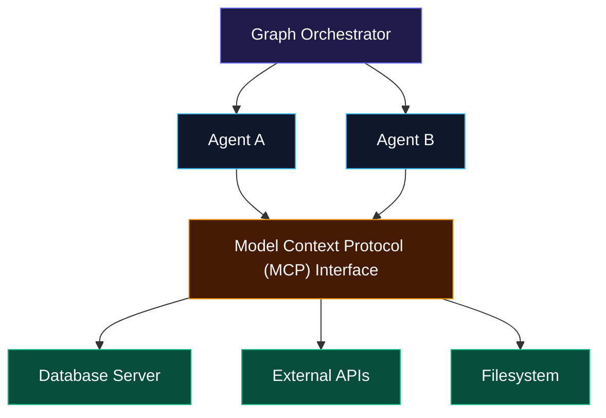

---

## Where this might go next

If this progression continues, the next step may not be another discrete framework so much as a shift toward systems that construct and revise their own workflows rather than relying on engineers to define every path in advance. Instead of a fixed sequence of steps laid out by a developer, a system might determine what capabilities a goal requires, construct a workflow suited to it, execute that workflow, evaluate the outcome, and revise the workflow itself before continuing.

### A possible future architecture

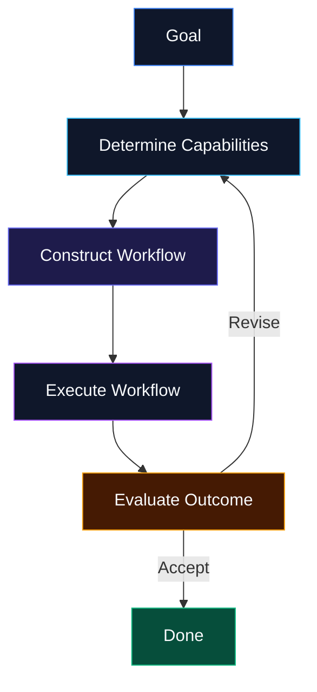

That said, more autonomy is not automatically an improvement. As a system is given more freedom to act and modify its own behavior, the engineering work around it has to grow correspondingly — safety constraints, permissioning, observability, evaluation, the ability to roll back a bad decision, human oversight, cost controls, and clearly deterministic boundaries around what the system is and isn't allowed to do on its own. The likely direction, then, is probably not "let the system handle everything," but something closer to giving a system latitude where flexibility genuinely helps and imposing deterministic control where reliability matters more — which is exactly the kind of distinction graph-based architectures are built to express.

---

## Summary

| Era  | Primary problem                                      | Engineering response      | Core abstraction |
| ---- | ---------------------------------------------------- | ------------------------- | ---------------- |
| 2022 | The model doesn't reliably follow the intended task  | Prompt engineering        | Prompt           |
| 2023 | The model lacks the information it needs             | Context engineering / RAG | Context          |
| 2024 | The model needs to act on external systems           | Agent engineering         | Agent / tools    |
| 2025 | Complex tasks need repeated attempts and feedback    | Loop engineering          | Loop             |
| 2026 | Complex loops need explicit control and coordination | Graph engineering         | State and graph  |

There is a deeper pattern running underneath all five stages. Early LLM engineering was model-centric — the model sat at the center of the application, and most of the developer's attention went into what to put in the prompt. Retrieval brought in external information; agents brought in external capability; loops brought in feedback; graphs brought in explicit orchestration across all of it. With each step, the center of gravity moved a little further from the model itself and a little closer to the system surrounding it.

### The evolution at a glance

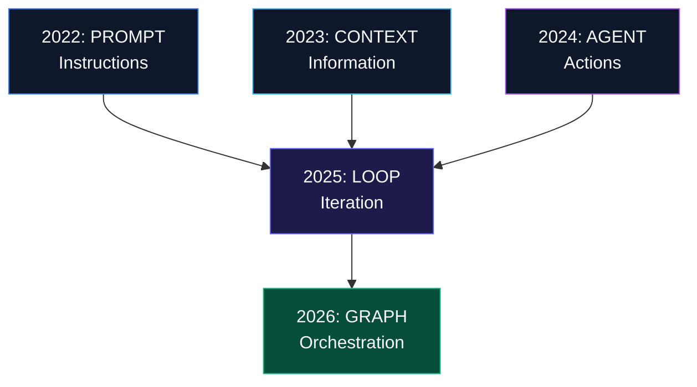

Once applications reach this level of complexity, writing a good prompt is only a small part of the job. A production AI engineer is realistically working across several layers at once: model selection and routing; prompt design; retrieval, memory, and context construction; integration with external tools and APIs; agent planning and decision-making; retry logic, evaluation, and error recovery; graph state, routing, and human approval steps; and the surrounding infrastructure of observability, tracing, security, latency, and cost.

---

## The cost side of graph engineering

None of this makes graphs an unconditionally better choice, and it would be a mistake to read this piece as another argument that agents or graphs are simply the future and should be adopted by default. Every additional node in a graph is a potential failure point. Every additional agent adds communication overhead. Every additional LLM call adds cost, latency, and another chance for a hallucinated output, on top of making the system harder to debug. More state means memory management and consistency become real engineering problems in their own right, and more branches make both testing and evaluation substantially harder, since edge cases multiply with every added path.

The right lesson isn't that agents or graphs should always be used — it's closer to the opposite. Use the simplest architecture that reliably solves the problem in front of you. A plain prompt beats an agent when a prompt is enough to get the job done. A deterministic workflow beats an autonomous agent when the process is genuinely predictable. One agent beats five when a single agent can handle the task reliably on its own. A loop beats a graph when the process really is just a loop. Graphs earn their complexity only when a system has enough state, branching, coordination, and need for control that those relationships have to be made explicit to work at all.

---

## Is prompt engineering dead?

No, and this is one of the more persistent misreadings of how this evolution actually went. Prompt engineering did not disappear; it became embedded inside larger architectures. A graph node may contain a prompt. An agent may run on several prompts internally. A retrieval system may use a prompt just to generate better search queries. An evaluator, a planner, or a tool-selection component may each be built on a prompt of their own. Prompt engineering did not become irrelevant so much as it became one component among several — the same is true of RAG, which agents frequently depend on rather than replace, and of loops, which graphs frequently contain rather than supersede. The overall trajectory here is composition, not replacement.

---

## A new mental model

The core lesson from all of this isn't that every engineer needs to learn a new framework each year. It's that the basic unit of engineering has kept expanding: from the model itself, to the prompt, to the context, to the agent, to the loop, and now increasingly to the system as a whole. The model is no longer the application — it's a component inside the application — and the engineers who work well in this space increasingly need to think simultaneously like software engineers, systems engineers, distributed-systems designers, ML engineers, product engineers, and workflow designers.

---

## Conclusion

The evolution traced here can be summarized in five words: prompt, context, agent, loop, graph. Each layer emerged because the one before it wasn't sufficient for a new class of problem. Prompt engineering gave developers control over instructions. Context engineering gave models access to relevant information beyond their training data. Agent engineering gave models the ability to take actions in the world. Loop engineering gave systems the ability to iterate and recover from their own mistakes. Graph engineering gives developers an explicit way to orchestrate all of the above across a genuinely complex system.

### The complete evolution

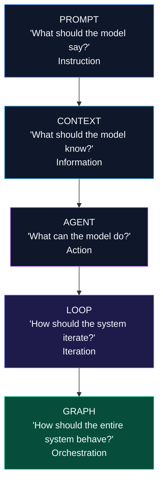

None of these layers actually went away. A modern AI application can, and often does, contain all five at once: a graph coordinating multiple agents and human checkpoints, each agent running its own reasoning loop, each loop calling out to tools, each tool call informed by retrieved context, and each step of that context ultimately shaped by a prompt sitting underneath an LLM. The shift worth remembering is this: the goal was never really about finding the perfect prompt. It has increasingly become about designing the right system around the model — where the model generates, the context informs, the tools act, the loop learns from what happens, the graph coordinates the whole, and the engineer designs the boundaries between all of it.
