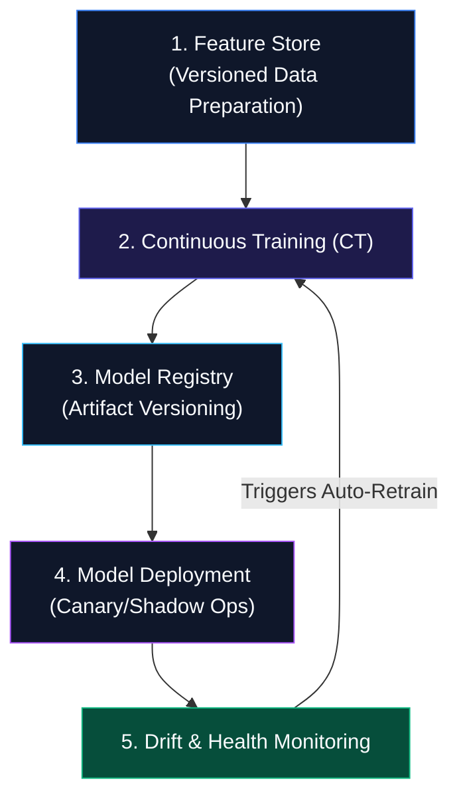

# MLOps Explained: The Complete Architecture of Production Machine Learning

DevOps is concerned with continuously building, testing, and deploying code. MLOps takes on the same mission but has to track three moving parts at once instead of one: code, data, and the model itself. That third piece is what makes machine learning different from ordinary software — in most code, 2 + 2 always equals 4, but a model trained today can quietly degrade next week simply because customer behavior shifted underneath it. MLOps is the set of practices and infrastructure built to automate that whole lifecycle, from ingesting data through continuous retraining, so a model stays reliable and accurate well after it first ships.

## 1. An analogy: the automated bakery

Running an automated bakery involves two distinct concerns. Traditional DevOps is the part that keeps the mixers, ovens, and conveyor belts running without breaking down — infrastructure and code. MLOps is the part that notices when humidity changes, flour quality shifts, or customer tastes move, and adjusts the recipe automatically, inspects the output for quality, and flags the chef before a bad batch reaches the shelves. It's the data, the model, and the infrastructure working together rather than any one of them alone.

## 2. The core architecture: five connected systems

An MLOps setup at scale generally runs as five systems feeding into each other in a loop.



**Feature store.** A centralized place where raw data gets turned into pre-computed features, ensuring the same features used at training time are also what the live prediction path sees — otherwise training and production quietly drift apart. Feast, Hopsworks, and SageMaker Feature Store are common choices here.

**Continuous training.** Instead of a fixed release schedule, retraining gets triggered automatically — on a schedule (every Sunday at midnight, say), on an event (once 10,000 new labeled samples come in), or on a metric (production accuracy dropping below a set threshold, like 92%).

**Model registry.** Something like a version control system built for models rather than code. Before a model goes live, it gets registered with a version tag, metadata about its training parameters and dataset, and its validation metrics attached. MLflow, Weights & Biases, and Neptune.ai are the usual tools for this.

**Deployment strategy.** Production systems rarely push a new model straight to all live traffic. A shadow deployment runs the new model alongside the old one on real requests, logging its predictions without actually serving them to users. A canary deployment routes a small slice of traffic — 5%, say — to the new model, watches how it performs, and scales up gradually if things hold.

**Drift monitoring.** Models decay over time in two distinct ways worth tracking separately. Data drift is a shift in the inputs themselves — a credit scoring model suddenly seeing applicants from a demographic it wasn't trained on. Concept drift is a shift in the relationship between input and outcome — buying patterns changing sharply during a pandemic, for instance, even though the inputs look similar to before.

## 3. DevOps versus MLOps

| Feature | Traditional DevOps | Production MLOps |
| --- | --- | --- |
| Core artifact | Code binaries, Docker images | Code, datasets, and model weights together |
| Testing scope | Unit tests, integration tests | Data validation, model quality checks, bias checks |
| Trigger for action | A new code commit | Code changes, or data drift, or an accuracy drop |
| Monitoring target | CPU, RAM, latency, error rates | System metrics plus data drift plus model accuracy |

## 4. Model validation and registry with MLflow

This walks through a small pipeline that trains a model, checks it against a production accuracy threshold, and only registers it if it clears the bar:

```python
import mlflow
import mlflow.sklearn
from sklearn.ensemble import RandomForestClassifier
from sklearn.metrics import accuracy_score

# Mock training data
X_train, y_train = [[1, 2], [2, 3], [3, 4], [4, 5]], [0, 0, 1, 1]
X_val, y_val = [[1, 2], [3, 4]], [0, 1]

# Set tracking URI (MLflow server)
mlflow.set_experiment("Fraud_Detection_MLOps")

with mlflow.start_run() as run:
    # 1. Train model
    params = {"n_estimators": 50, "max_depth": 3}
    model = RandomForestClassifier(**params)
    model.fit(X_train, y_train)

    # 2. Evaluate performance
    predictions = model.predict(X_val)
    accuracy = accuracy_score(y_val, predictions)

    # 3. Log hyperparameters and metrics
    mlflow.log_params(params)
    mlflow.log_metric("accuracy", accuracy)

    # 4. Automated MLOps gate: register only if accuracy meets threshold
    ACCURACY_THRESHOLD = 0.85

    if accuracy >= ACCURACY_THRESHOLD:
        print(f"[MLOps Gate Passed] Accuracy {accuracy:.2f} >= {ACCURACY_THRESHOLD}. Registering Model...")
        mlflow.sklearn.log_model(
            sk_model=model,
            artifact_path="fraud_model",
            registered_model_name="Production_Fraud_Detector"
        )
    else:
        print(f"[MLOps Gate Failed] Accuracy {accuracy:.2f} below threshold. Deployment aborted.")
```

```
[MLOps Gate Passed] Accuracy 1.00 >= 0.85. Registering Model...
```

## The core idea

What MLOps really changes is how much of this stays manual. Feature stores, continuous training, a model registry, and drift monitoring together turn what would otherwise be a one-off training exercise into something closer to an assembly line — one that keeps catching problems and retraining on its own long after the model first went live.
